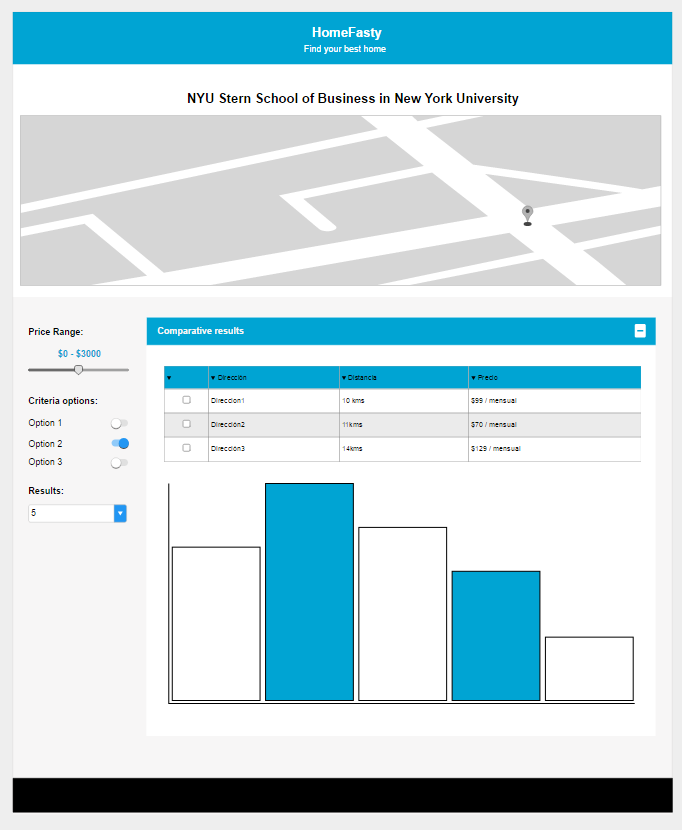
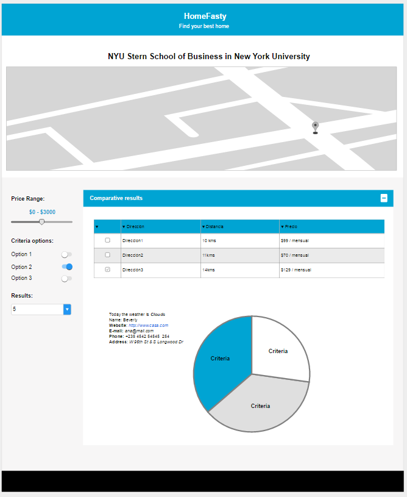

# HomeFasty 

**Keywords:** Fast, low cost and security

HomeFasty allows you to find the ideal rental house that will provide the best university experience. Start this new adventure by finding the home that best suits your economic possibilities and required parameters, such as safety, health, climate, etc.

**Technologies:**
* Boostrap v3.3.7
* JQuery v3.2.0
* JQuery UI v1.12.1
* D3.js v4

**Data:**
* [Zillow API](https://www.zillow.com/howto/api/APIOverview.htm)
* [Google maps API](https://developers.google.com/maps/)
* [Data.gov](https://www.data.gov/)
* [Climate Data Online](https://www.ncdc.noaa.gov/cdo-web/)

**Map View:**
* Basic Map with specific location of rental houses 
* Markers for location of houses
* Labels for houses' names

**Data Visualization:**
* Bar Chart: Make comparisons between selected income options.
* Pie Chart: Shows the detail of each of the criteria of the selected income.

**Interaction Form:**
* Form that will allow you to create search filters
* Price range
* Number of results
* Criteria

The project does not use frameworks, or technologies that require installation or configuration.

**Browser Test Case:**
* Chrome 57.0.2987.133
* IE ( No work )
* Safari ( No work )
* Firefox 45.8.0

[ Demo ](http://45.55.32.24/ironhacks/2017-Purdue-Platzi-IronHack-ageekart/)

**Basic Wireframes**

**Author**
Ana Pérez - @ageekart