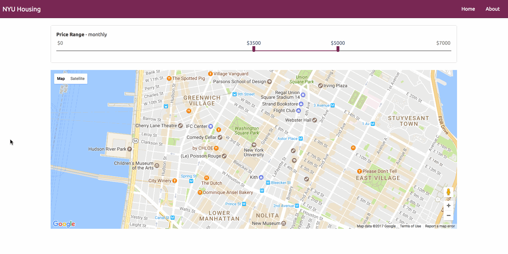

# NYU Housing

## Design (Phase 1)
The NYU Housing application is built with [AngularJS](https://angularjs.org/), a JavaScript front-end framework maintained by Google. The framework allows for client-side MVC architecture. A map view of New York University is provided by the [Google Maps API](https://developers.google.com/maps/]).

I plan on incorporating weather and public museum information to the map by using datasets from [Climate Data Online](https://www.ncdc.noaa.gov/cdo-web/) and [Data.gov](https://www.data.gov/). The source of property information about available rentals currently on the market is still being researched.

#### UI

## Requirements

1. npm (available through [node](https://nodejs.org/en/))
2. [bower](https://bower.io/)
3. [grunt](https://gruntjs.com/)

## Build & development

Run `grunt` for building and `grunt serve` for preview.

## Testing

Running `grunt test` will run the unit tests with karma.
